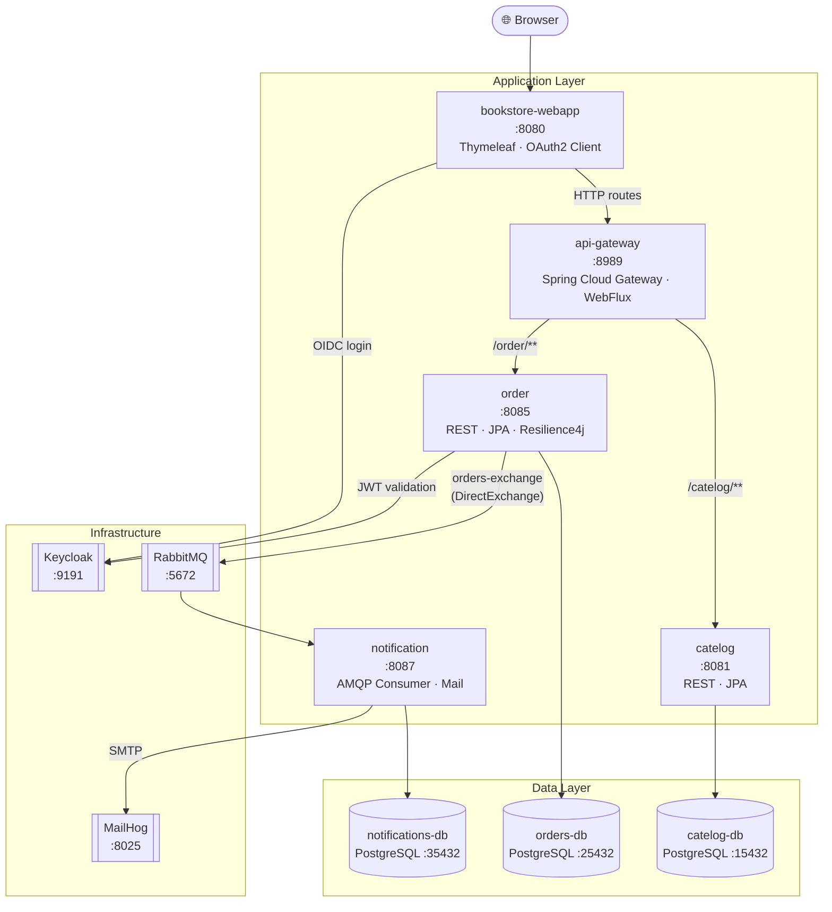
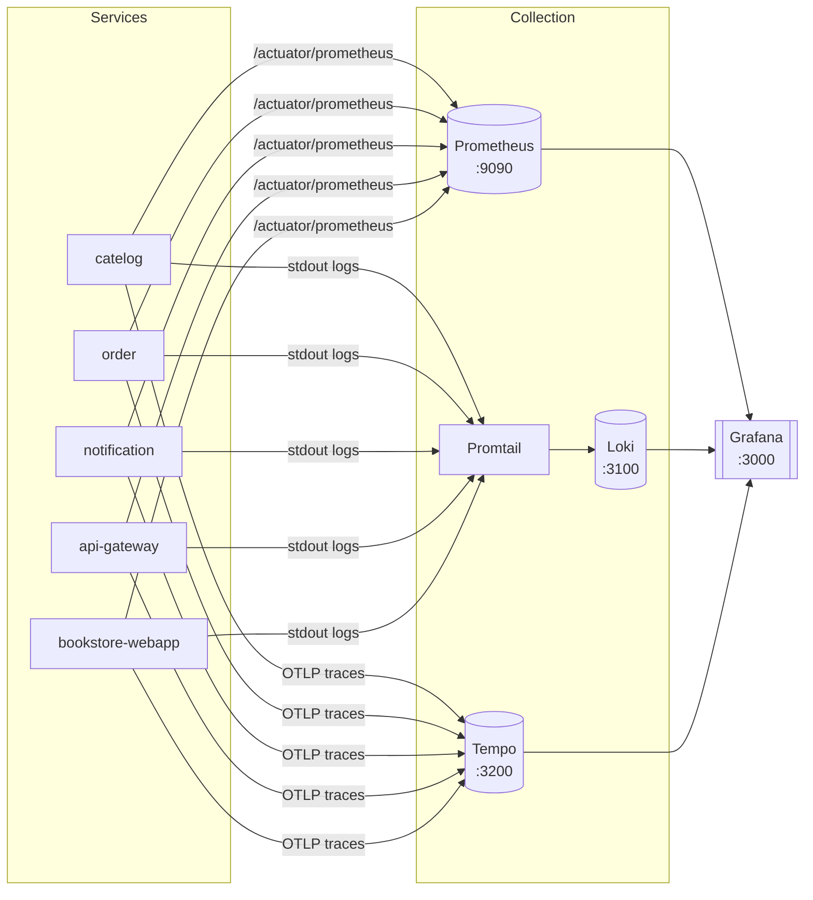

<div align="center">

# 📚 BookStore

### A production-ready, cloud-native Online Bookstore built on microservices


**[Features](#-features) · [Architecture](#-architecture) · [Quick Start](#-quick-start) · [Services](#-services--endpoints) · [Configuration](#-environment-variables) · [Messaging](#-messaging--events) · [Observability](#-observability) · [Roadmap](#-roadmap)**

</div>

---

## ⚡ Quick Start

> **Prerequisites:** Docker & Docker Compose installed. That's it.

```bash
git clone https://github.com/ReddysaiJ/BookStore.git
cd BookStore

# 1. Start infrastructure (Postgres × 3, RabbitMQ, Keycloak, MailHog)
docker compose -f deployment/docker-compose/infra.yml up -d

# 2. Build images and start all services
docker compose -f deployment/docker-compose/apps.yml up -d

# 3. Open the app
open http://localhost:8080   # macOS
xdg-open http://localhost:8080  # Linux
```

Login with a pre-configured account — see [Keycloak Setup](#-keycloak-setup) for credentials.

> **Full stack including observability:**
> ```bash
> docker compose \
>   -f deployment/docker-compose/infra.yml \
>   -f deployment/docker-compose/apps.yml \
>   -f deployment/docker-compose/monitoring.yml up -d
> ```

---

## 📌 Overview

BookStore is a **microservices-based online bookstore** demonstrating production patterns on Spring Boot 3.5 and Java 21.

Users browse books, place orders, and receive email notifications — all secured via Keycloak OAuth2. Each service owns its own PostgreSQL database, communicates asynchronously via RabbitMQ, and exposes metrics, logs, and traces to a Grafana observability stack.

### What makes this production-ready

| Pattern | Implementation |
|---|---|
| Database-per-Service | Each service has an isolated PostgreSQL instance |
| Async messaging | RabbitMQ with durable queues + outbox-style retry jobs |
| Distributed tracing | OpenTelemetry → Tempo, correlated with logs in Grafana |
| Resilience | Resilience4j retry + circuit breaker on inter-service calls |
| Schema versioning | Flyway migrations on every service startup |
| Distributed locking | ShedLock (JDBC) prevents duplicate scheduled job runs |
| Graceful shutdown | All services configured with `GRACEFUL` shutdown mode |
| Identity & Auth | Keycloak OIDC with realm auto-import on startup |

---

## ✨ Features

### 👤 User
- Browse paginated book catalog
- Place and track orders through their full lifecycle
- OAuth2 login via Keycloak (no password stored in the app)
- Email notifications for every order state change

### 🛠 Admin
- Manage the book catalog (add, update, remove)
- View and manage all orders across users
- Monitor system health via Grafana dashboards

### 🔐 Security
- Keycloak as the Identity Provider (OIDC / OAuth2)
- Authorization Code flow for the web app
- JWT Bearer token validation in the Order service
- Role-based route authorization

### 📡 Observability
- **Metrics** — Micrometer → Prometheus → Grafana
- **Logs** — Promtail → Loki → Grafana (correlated with traces)
- **Traces** — OpenTelemetry → Tempo → Grafana

---

## 🏗 Architecture

### Service Communication



### Observability Pipeline



---

## 🧰 Technology Stack

| Layer | Technology |
|---|---|
| Backend | Java 21, Spring Boot 3.5.6 |
| API Gateway | Spring Cloud Gateway (WebFlux / Netty) |
| ORM | Hibernate (JPA) |
| Database | PostgreSQL 15 (per-service isolation) |
| Schema Migration | Flyway |
| Messaging | RabbitMQ 3.12 (durable, DirectExchange) |
| Security / Auth | Spring Security, Keycloak 24, OAuth2 / OIDC |
| Frontend | Thymeleaf, Bootstrap 5, Alpine.js |
| Email | Spring Boot Mail (MailHog for local dev) |
| Resilience | Resilience4j (retry, circuit breaker) |
| Job Locking | ShedLock (JDBC provider) |
| Observability | Prometheus, Grafana, Loki, Tempo, Promtail, OpenTelemetry |
| Build | Maven 3.9 (Maven Wrapper) |
| Task Runner | Taskfile |
| Containerization | Docker, Docker Compose |

---

## 🗂 Project Structure

```
BookStore/
├── api-gateway/                         # Spring Cloud Gateway — WebFlux / Netty
│   └── src/main/resources/
│       └── application.yml              # Routes, CORS, Swagger aggregation
│
├── bookstore-webapp/                    # Thymeleaf UI + OAuth2 client
│   └── src/main/java/.../webapp/
│       ├── clients/                     # Typed HTTP clients (catelog, orders)
│       ├── config/SecurityConfig.java   # OAuth2 login, route protection
│       └── web/controllers/             # ProductController, OrderController
│
├── catelog/                             # Book catalog service
│   └── src/main/java/.../catelog/
│       ├── domain/                      # ProductService, ProductRepository, ProductEntity
│       └── web/controllers/             # REST endpoints, GlobalExceptionHandler
│
├── order/                               # Order lifecycle service
│   └── src/main/java/.../order/
│       ├── clients/catelog/             # Resilience4j-wrapped catalog HTTP client
│       ├── config/                      # RabbitMQ, Security, Scheduler, OpenAPI config
│       ├── domain/                      # OrderService, event models, outbox publisher
│       └── jobs/                        # ShedLock jobs: OrderEventsPublishingJob,
│                                        #               OrderProcessingJob
│
├── notification/                        # Email notification consumer
│   └── src/main/java/.../notification/
│       ├── config/RabbitMQConfig.java   # Queue + exchange declarations
│       ├── domain/                      # NotificationService, OrderEventEntity
│       └── events/OrderEventHandler.java # AMQP listeners → email dispatch
│
├── deployment/
│   └── docker-compose/
│       ├── infra.yml                    # PostgreSQL ×3, RabbitMQ, Keycloak, MailHog
│       ├── apps.yml                     # All 5 Spring Boot services
│       ├── monitoring.yml               # Prometheus, Grafana, Loki, Tempo, Promtail
│       └── realm-config/
│           └── bookstore-realm.json     # Keycloak realm auto-import
│
├── Taskfile.yml                         # build, start, stop, restart, monitoring tasks
└── pom.xml                              # Parent POM (multi-module Maven project)
```

---

## 🧩 Services & Endpoints

| Service | Port | URL / UI | Credentials |
|---|---|---|---|
| `bookstore-webapp` | 8080 | http://localhost:8080 | Keycloak login |
| `api-gateway` | 8989 | http://localhost:8989/swagger-ui.html | — |
| `catelog` | 8081 | http://localhost:8081/actuator/health | — |
| `order` | 8085 | http://localhost:8085/actuator/health | — |
| `notification` | 8087 | http://localhost:8087/actuator/health | — |
| `catelog-db` | 15432 | `jdbc:postgresql://localhost:15432/postgres` | `postgres / 1212` |
| `orders-db` | 25432 | `jdbc:postgresql://localhost:25432/postgres` | `postgres / 1212` |
| `notifications-db` | 35432 | `jdbc:postgresql://localhost:35432/postgres` | `postgres / 1212` |
| `bookstore-rabbitmq` | 5672 | http://localhost:15672 (Management UI) | `guest / 1212` |
| `keycloak` | 9191 | http://localhost:9191 | `admin / 1212` |
| `mailhog` | 8025 | http://localhost:8025 | — |
| `prometheus` | 9090 | http://localhost:9090 | — |
| `grafana` | 3000 | http://localhost:3000 | `admin / admin123` |

---

## ▶️ Running the Application

### Option A — Taskfile (Recommended)

```bash
task build            # Build all 5 Docker images via Spring Boot Maven Plugin
task start            # build + start infra & all app services
task start_infra      # Start only infrastructure (Postgres, RabbitMQ, Keycloak, MailHog)
task start_monitoring # Start Prometheus, Grafana, Loki, Tempo, Promtail
task stop             # Stop and remove all app + infra containers
task stop_infra       # Stop infra only
task stop_monitoring  # Stop observability stack
task restart          # Full stop → sleep → start cycle
task restart_infra    # Restart infra only
task restart_monitoring # Restart observability only
task test             # Run full test suite (mvn clean verify)
```

### Option B — Docker Compose directly

```bash
# Infrastructure
docker compose -f deployment/docker-compose/infra.yml up -d

# Application services
docker compose -f deployment/docker-compose/apps.yml up -d

# Observability
docker compose -f deployment/docker-compose/monitoring.yml up -d
```

### Option C — Run locally (no Docker for services)

```bash
# Start only infra in Docker
docker compose -f deployment/docker-compose/infra.yml up -d

# Run each Spring Boot service
cd catelog          && ../mvnw spring-boot:run
cd order            && ../mvnw spring-boot:run
cd notification     && ../mvnw spring-boot:run
cd api-gateway      && ../mvnw spring-boot:run
cd bookstore-webapp && ../mvnw spring-boot:run
```

### Build Docker Images manually

```bash
./mvnw -pl catelog          spring-boot:build-image -DskipTests
./mvnw -pl order            spring-boot:build-image -DskipTests
./mvnw -pl notification     spring-boot:build-image -DskipTests
./mvnw -pl api-gateway      spring-boot:build-image -DskipTests
./mvnw -pl bookstore-webapp spring-boot:build-image -DskipTests
```

### Reset everything (full clean slate)

```bash
# Stop containers AND delete all volumes (Flyway state, DB data, Keycloak state)
docker compose \
  -f deployment/docker-compose/infra.yml \
  -f deployment/docker-compose/apps.yml \
  -f deployment/docker-compose/monitoring.yml \
  down -v

# Then start fresh
task start
```

> ⚠️ Use `down -v` when Flyway reports checksum errors or Keycloak state becomes corrupted.

---

## 🔑 Keycloak Setup

Keycloak auto-imports the `bookstore` realm on first startup via `--import-realm`. No manual configuration is needed.

### Pre-configured test accounts

| Username | Role | Notes |
|---|---|---|
| `reddysai21` | `default-roles-bookstore` | Primary test user |

> Passwords are hashed in the realm JSON. To view or reset them: open the **Keycloak Admin Console** at http://localhost:9191 and log in with `admin / 1212`, then navigate to **Realm: bookstore → Users**.

### OAuth2 client

The `bookstore-webapp` client is pre-registered in the realm. The web app uses the Authorization Code flow — after login, Keycloak issues a JWT that the Order service validates on every request.

---

## 🌍 Environment Variables

All variables are set in `deployment/docker-compose/apps.yml`. Override them via a `.env` file in the project root for local customization.

### Database

| Variable | Services | Default | Description |
|---|---|---|---|
| `DB_URL` | catelog, order, notification | per-service JDBC URL | PostgreSQL JDBC connection string |
| `DB_USERNAME` | catelog, order, notification | `postgres` | Database username |
| `DB_PASSWORD` | catelog, order, notification | `1212` | Database password |

### RabbitMQ

| Variable | Services | Default | Description |
|---|---|---|---|
| `RABBITMQ_HOST` | order, notification | `bookstore-rabbitmq` | Broker hostname |
| `RABBITMQ_PORT` | order, notification | `5672` | AMQP port |
| `RABBITMQ_USERNAME` | order, notification | `guest` | Broker username |
| `RABBITMQ_PASSWORD` | order, notification | `1212` | Broker password |

### Auth / Keycloak

| Variable | Services | Default | Description |
|---|---|---|---|
| `OAUTH2_SERVER_URL` | order, bookstore-webapp | `http://keycloak:9191` | Keycloak base URL |

### Service Discovery (internal URLs)

| Variable | Services | Default | Description |
|---|---|---|---|
| `CATELOG_URL` | api-gateway | `http://catelog:8081` | Catalog service upstream |
| `ORDER_URL` | api-gateway | `http://order:8085` | Order service upstream |
| `ORDERS_CATELOG_URL` | order | `http://api-gateway:8989/catelog` | Catalog URL used by Order service |
| `BOOKSTORE_API_GATEWAY_URL` | bookstore-webapp | `http://api-gateway:8989` | Gateway URL used by the web app |

### Email

| Variable | Services | Default | Description |
|---|---|---|---|
| `MAIL_HOST` | notification | `mailhog` | SMTP host (MailHog locally) |
| `MAIL_PORT` | notification | `1025` | SMTP port |

### Observability

| Variable | Services | Default | Description |
|---|---|---|---|
| `MANAGEMENT_TRACING_ENABLED` | All | `true` | Enable OpenTelemetry tracing |
| `MANAGEMENT_ZIPKIN_TRACING_ENDPOINT` | All | `http://tempo:9411/api/v2/spans` | Trace export endpoint |
| `SPRING_PROFILES_ACTIVE` | All | `docker` | Active Spring profile |

---

## 📨 Messaging & Events

The `order` service publishes all order lifecycle events to a `DirectExchange` named **`orders-exchange`**. The `notification` service declares the same exchange and binds its queues to it.

### Exchange & Queues

| Exchange | Type | Queue | Routing Key | Trigger |
|---|---|---|---|---|
| `orders-exchange` | Direct | `new-orders` | `new-orders` | Order placed successfully |
| `orders-exchange` | Direct | `delivered-orders` | `delivered-orders` | Order marked delivered |
| `orders-exchange` | Direct | `cancelled-orders` | `cancelled-orders` | Order cancelled |
| `orders-exchange` | Direct | `error-orders` | `error-orders` | Processing failure |

### Reliability

- All events are persisted to the database **before** publishing (outbox pattern).
- `OrderEventsPublishingJob` (in `order`) re-publishes any unpublished events every 30s.
- `notification` persists received events and retries failed email sends.
- **ShedLock** (JDBC-backed) ensures only one instance runs each scheduled job across horizontal replicas.

---

## 🔁 Resilience

The `order` service wraps all calls to the `catelog` service with Resilience4j:

| Pattern | Setting | Value |
|---|---|---|
| Retry | Max attempts | 2 |
| Retry | Wait between retries | 1 second |
| Circuit Breaker | Sliding window type | COUNT_BASED |
| Circuit Breaker | Window size | 6 calls |
| Circuit Breaker | Failure rate threshold | 50% |
| Circuit Breaker | Half-open test calls | 2 |

The circuit opens after 3 failures in 6 calls, then allows 2 test calls through before closing again.

---

## 🗄 Database & Migrations

Each service manages its own schema with **Flyway**, which runs automatically on startup.

Migration scripts live at:
```
<service>/src/main/resources/db/migration/V*.sql
```

**Troubleshooting Flyway:**

| Problem | Solution |
|---|---|
| Checksum mismatch on an existing migration | Never edit applied migrations. Create a new `V{n+1}` script instead. |
| Half-applied migration leaving DB in bad state | Run `docker compose down -v` to reset volumes, then restart. |
| Need to force-repair in a dev environment | Run `flyway repair` after manual inspection — never in production without understanding the state. |

---

## 📡 Observability

Once the monitoring stack is running (`task start_monitoring`), open **Grafana** at http://localhost:3000 (`admin / admin123`).

Pre-wired data sources: **Prometheus**, **Loki**, **Tempo** — no manual setup needed.

| Signal | How to query in Grafana |
|---|---|
| Metrics | Explore → Prometheus → e.g. `http_server_requests_seconds_count` |
| Logs | Explore → Loki → filter by `{service_name="order"}` |
| Traces | Explore → Tempo → search by `traceId` or service name |
| Correlated | Click a trace span → "Logs for this span" links directly to Loki |

Traces are exported via **OpenTelemetry** using the Zipkin-compatible endpoint on Tempo (`:9411`). All services share trace context via `W3C TraceContext` propagation headers.

---

## 🛠 Contributing

Contributions are welcome. Please follow these steps:

1. Fork the repository
2. Create a feature branch: `git checkout -b feature/your-feature-name`
3. Commit with a clear message: `git commit -m "feat: add order cancellation endpoint"`
4. Push and open a Pull Request against `main`

**Commit convention:** Use [Conventional Commits](https://www.conventionalcommits.org/) — `feat:`, `fix:`, `docs:`, `refactor:`, `chore:`.

**Before submitting a PR:**
```bash
task test   # must pass — runs mvn clean verify
```

---

## 🚀 Roadmap

- [ ] Redis caching layer (cache-aside pattern) for catalog and order reads
- [ ] Docker image vulnerability scanning (Trivy)
- [ ] Online payment gateway integration (Stripe)
- [ ] Advanced Grafana dashboards (SLA tracking, queue depth alerts)

---

## 📌 Author

<div align="center">

**Reddysai Jonnadula**

[](mailto:reddysai2107@gmail.com)
[](https://github.com/ReddysaiJ)

</div>
